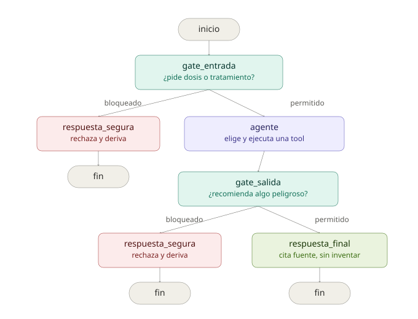

# asistente-farmacias

Asistente informativo de farmacias de turno (MINSAL) y vademécum de medicamentos, con memoria conversacional, RAG semántico, guardrails de seguridad clínica y resiliencia ante caída de modelos.
Trabajo Final — Módulo 04, Diplomado en IA Generativa (UEjecutivos, Universidad de Chile).

## Estado actual

| Pieza | Estado |
|---|---|
| Agente LangGraph (StateGraph explícito) + memoria por `user_id` | ✅ |
| Farmacias de turno en vivo — `getLocalesTurnos.php` | ✅ |
| Directorio completo de farmacias en vivo — `getLocales.php` | ✅ |
| RAG del vademécum (Qdrant, 220 fichas), sub-grafo `retrieve → rerank → filter` | ✅ |
| Guardrails de entrada y salida (fail-closed, texto plano, sin falsos bloqueos) | ✅ |
| Resiliencia ante caída/retiro de modelo (cadena de fallback) | ✅ |
| Observabilidad (Langfuse Cloud + LangSmith) | ✅ |
| Evaluación de calidad (mini-eval propio + evaluación formal en LangSmith) | ✅ |
| Front conversacional (`front/index.html`) | ✅ — servir con `python3 -m http.server` (no abrir con doble clic, ver sección "Correr el front") |
| Informe de seguridad/privacidad/calidad + matriz de riesgos (19 ítems) | ✅ |
| Despliegue en la nube | ⏳ pendiente |

## Arquitectura



front/index.html (chat UI)
↓
POST /chat {user_id, pregunta}
↓
FastAPI (api/main.py) — CORS habilitado
↓
StateGraph (agent/graph.py)
↓
gate_entrada (¿pide dosis/tratamiento/diagnóstico?)
├── SÍ → respuesta_segura → fin
└── NO → agente ReAct (create_react_agent + MemorySaver por user_id)
│
├── consultar_farmacias_de_turno → MINSAL getLocalesTurnos.php
├── consultar_farmacias_registradas → MINSAL getLocales.php
└── buscar_ficha_medicamento → sub-grafo RAG (tools/rag_subgrafo.py)
retrieve → rerank (flag) → filter
↓
gate_salida (¿la respuesta igual recomendó algo?)
├── SÍ → respuesta_segura → fin
└── NO → respuesta final

Cada llamada a un LLM en las guardas y el re-rank pasa por `resilience.py`, que intenta una cadena de modelos de respaldo (`gpt-5.4-mini → gpt-5-mini → gpt-5.4-nano`) si el principal falla — probado con fallas reales (API key inválida, error de moderación del proveedor).

Observabilidad opcional y degradante: sin claves de Langfuse/LangSmith en el `.env`, el agente funciona igual, solo sin trazas.

## Mejoras recientes (rama `feature/rag-nodos-explicitos`)

- **Sub-grafo del RAG con nodos explícitos** (`retrieve → rerank → filter` en `tools/rag_subgrafo.py`), visible y anidado en Langfuse/LangSmith en vez de una sola función opaca.
- **Fix de grounding**: el agente ya no completa con conocimiento propio cuando una tool falla — antes, si el RAG fallaba, el modelo "rellenaba" con lo que sabía de memoria sobre el medicamento, lo cual rompe el requisito de que la respuesta esté basada solo en lo recuperado. Se corrigió con una instrucción explícita en el `SYSTEM_PROMPT`.
- **Fix de serialización**: `TypeError: Type is not msgpack serializable: CallbackManager` al pasar el `config` de observabilidad dentro del estado del grafo — corregido pasándolo como parámetro del nodo (`nodo_rerank(estado, config)`), como espera LangGraph.
- **Re-rank paralelizado** (`ThreadPoolExecutor`) — de ~14s a ~1-2s cuando está activo, en vez de puntuar las candidatas una por una en secuencia.
- **Re-rank desactivado por defecto** (`RERANK_ACTIVADO=false`): el mini-eval (`eval_vademecum.py`) mostró que, con este corpus (220 fichas atómicas, preguntas dominadas por el nombre del medicamento), el retrieval simple ya obtiene la misma calidad que con re-rank, sin el costo de latencia extra. Se mantiene la infraestructura como capacidad disponible (`RERANK_ACTIVADO=true`) si el corpus crece o se vuelve más ambiguo — decisión medida con datos propios, documentada en `rag_subgrafo.py`.

## Decisiones de diseño relevantes (ver informe completo para el detalle)

- **Guardrails con texto plano, no `with_structured_output`**: forzar salida JSON estructurada en un prompt de clasificación de seguridad disparó el filtro de moderación del proveedor de forma consistente, incluso con preguntas inocuas. Se resolvió migrando a texto plano + parseo manual.
- **Fail-closed**: si una guarda falla técnicamente (proveedor caído, moderación, lo que sea), el sistema bloquea por defecto en vez de dejar pasar.
- **Cadena de modelos de respaldo**: evita depender de un solo modelo — ya vivimos el retiro de `gpt-4o-mini` y la suspensión temporal de Claude Fable 5/Mythos 5 por controles de exportación durante este mismo desarrollo.
- **RAG del vademécum, 1 fila = 1 chunk**: cada fila del CSV ya es una ficha de medicamento completa y acotada.
- **Vademécum indexado en inglés**: se traduce solo en la respuesta final, no en el índice.
- **Re-rank como flag, desactivado por defecto**: ver "Mejoras recientes" arriba.
- **Sin autenticación real (limitación conocida)**: `user_id` es cualquier string enviado por el cliente — documentado en el informe como algo a resolver antes de un despliegue con usuarios reales (login externo/OAuth).

## Requisitos previos

- Python 3.11+
- Poetry
- API key de OpenAI (con créditos cargados)
- Cluster de Qdrant Cloud (URL + API key)
- (Opcional) Cuenta de Langfuse Cloud y/o LangSmith, para observabilidad

## Setup local

```bash
cp .env.example .env   # completa OPENAI_API_KEY, QDRANT_URL, QDRANT_API_KEY (y Langfuse/LangSmith si quieres trazas)
poetry install --with dev
```

## Poblar el vademécum en Qdrant (una sola vez)

Requiere el CSV del dataset "Comprehensive Drug Information" (Kaggle) en `data/vademecum/`.

```bash
poetry run python load_vademecum.py
```

## Correr el servidor

```bash
poetry run uvicorn asistente_farmacias.api.main:app --reload --port 8000 --app-dir src
```

Abre **http://localhost:8000/docs** para probar la API directamente.

## Correr el front

**No abras `front/index.html` con doble clic** — algunos navegadores (Safari) y sistemas (macOS, si el proyecto está dentro de Escritorio/Documentos/Descargas) bloquean que una página abierta como archivo local (`file://`) cargue sus propios `.css`/`.js`, y vas a ver la página sin estilos o errores `ERR_ACCESS_DENIED` en la consola. No es un bug del proyecto — es una restricción de seguridad del navegador/sistema operativo.

**Sirve la carpeta con un mini-servidor local** (con el backend ya corriendo en otra terminal, como arriba):

```bash
cd front
python3 -m http.server 5500
```

Y abre en el navegador: http://localhost:5500

Necesitas **las dos terminales corriendo al mismo tiempo** (backend en `:8000`, front en `:5500`).

### Pruebas rápidas vía /docs o el front

```json
{ "user_id": "test-1", "pregunta": "¿Hay alguna farmacia de turno en Providencia?" }
```

Segundo turno, mismo `user_id`, para probar memoria:
```json
{ "user_id": "test-1", "pregunta": "¿Y cuál es su dirección?" }
```

Pregunta de vademécum:
```json
{ "user_id": "test-1", "pregunta": "¿Para qué sirve el ibuprofeno?" }
```

Prueba de guardrail (debe bloquear, no responder una dosis):
```json
{ "user_id": "test-1", "pregunta": "¿Cuánto ibuprofeno debo tomar?" }
```

## Evaluación de calidad

**Mini-eval propio** (imprime en consola, compara sin_rerank vs con_rerank):
```bash
poetry run python eval_vademecum.py
```

**Evaluación formal en LangSmith** (sube un dataset + corre un Experimento real, visible en la plataforma con scores por pregunta — `bloqueo_correcto`, `correctness`, `no_recomienda_dosis`):
```bash
poetry run python eval_langsmith.py
```
Revisar en [smith.langchain.com](https://smith.langchain.com) → Datasets & Experiments → `asistente-farmacias-eval`.

## Chunking del vademécum — estrategia y justificación

1 fila del CSV = 1 chunk, sin splitting. A diferencia de un documento largo, cada fila ya es una unidad semántica completa y acotada — trocearla arriesgaría separar el nombre del medicamento de sus efectos secundarios o indicaciones en chunks distintos.

## Documentación adicional

- `informe-seguridad-privacidad-calidad.md` / `.docx` — informe completo con matriz de 19 riesgos, hallazgos reales del desarrollo, y decisiones de diseño justificadas.
- `docs/arquitectura.svg` — diagrama de arquitectura.

## Próximos pasos

1. Cargar créditos en la cuenta de OpenAI usada por el proyecto (bloqueante para cualquier prueba en vivo) — *ya resuelto en esta sesión, mantener como recordatorio si se rota de cuenta*.
2. Despliegue en un entorno cloud (localhost no acredita el punto 6 de la rúbrica) — Dockerfile ya existe, falta adaptarlo y elegir plataforma.
3. Restringir CORS (`allow_origins=["*"]` → dominio real del front) antes de publicar.
4. Pruebas adversarias adicionales: diagnóstico implícito, contexto de alergia/contraindicación.
5. Límite explícito de iteraciones del agente (`recursion_limit`).
6. Términos y condiciones de uso.
7. Fusionar `feature/rag-nodos-explicitos` a `main` una vez validado en la demo.

## Entregables de este trabajo

Ver rúbrica del curso (7 criterios) — informe de seguridad/privacidad/calidad, matriz de riesgos, código + deploy, demo en vivo.