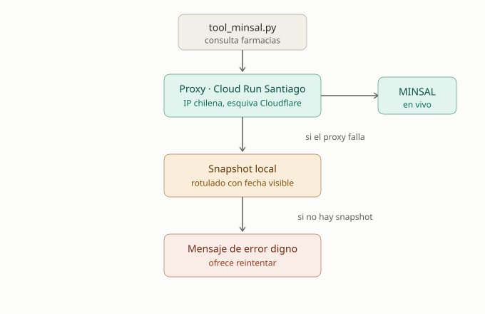

# Proxy de MINSAL — por qué existe y cómo funciona

## El problema que resuelve

La API de MINSAL (`midas.minsal.cl`) está detrás de **Cloudflare**, que
bloquea con **403 Forbidden** las peticiones que llegan desde IP de datacenter
extranjeras. Esto no es una restricción por país sino por *tipo* de IP: Cloudflare
distingue tráfico residencial/ISP (permitido) de tráfico de nube/datacenter
(bloqueado, por ser el patrón típico de bots y scraping).

Esto se confirmó con evidencia real, no como sospecha:
- **GitHub Actions** (runner en Azure, EE.UU.): `403`, IP `52.176.138.180`.
- **Deploy real en Render** (EE.UU.): ambos endpoints devolvían el mensaje de
  error "La API de MINSAL no está respondiendo", confirmado por Postman contra
  el servicio desplegado.
- **Postman desde un computador local en Chile** (IP residencial chilena): funciona
  sin problema.

La conclusión: **ninguna plataforma de hosting extranjera** (Render, Railway,
Fly.io, etc.) puede consultar MINSAL directamente, porque todas usan IP de
datacenter. Cambiar de plataforma extranjera no resuelve nada.

## La solución: un proxy con IP chilena

Se desplegó un **proxy propio en Google Cloud Run, región `southamerica-west1`
(Santiago de Chile)**. Al correr físicamente en Chile con IP chilena, el proxy
sí puede consultar MINSAL sin caer en el bloqueo de Cloudflare. El flujo es:

```
backend (Render, EE.UU.)
   │  no puede llamar a MINSAL directo (Cloudflare 403)
   ▼
proxy (Cloud Run, Santiago — IP chilena)
   │  sí puede
   ▼
MINSAL (midas.minsal.cl)
```

El backend ya no llama a `midas.minsal.cl` directamente — llama al proxy, que
reenvía la consulta a MINSAL y devuelve la respuesta.

**URLs del proxy** (configuradas en `tools/tool_minsal.py`):
- Turnos: `https://minsal-proxy-70640654403.southamerica-west1.run.app/turnos`
- Locales: `https://minsal-proxy-70640654403.southamerica-west1.run.app/locales`

El `TIMEOUT_SEGUNDOS` se subió de 5 a **10 segundos** porque el proxy agrega un
salto de red extra (backend → proxy → MINSAL), aumentando la latencia total.

## Cadena de resiliencia completa (defensa en profundidad)



La consulta de farmacias tiene **tres niveles**, cada uno respaldando al anterior:

1. **Proxy en vivo** (Cloud Run Santiago) → dato real y actual de MINSAL. Camino normal.
2. **Snapshot local** (`data/snapshot_minsal_*.json`) → si el proxy falla (timeout,
   caída, error), la tool cae a un snapshot estático capturado antes, **rotulado
   con la fecha de captura visible**. Explícitamente permitido por el enunciado:
   *"snapshot documentado con fecha visible... no puede presentarse como dato en
   vivo si no lo es"*. Ver `generar_snapshot_minsal.py`.
3. **Mensaje de error digno** → si ni el proxy ni el snapshot responden, la tool
   devuelve un mensaje claro que ofrece reintentar o consultar la otra tool, en
   vez de un error crudo o un crash.

Esto cumple exactamente el requisito del enunciado para la Tool MINSAL:
*"con timeout, caché corta y fallback digno documentado"* — timeout (10s), caché
(15 min), y fallback (snapshot rotulado + mensaje digno).

Ambos caminos (proxy en vivo y fallback snapshot) fueron probados localmente:
- Camino normal: dato en vivo real, confirmado en el front y en trazas de LangSmith.
- Camino fallback: bloqueando `midas.minsal.cl` vía `/etc/hosts` (IPv4 e IPv6),
  se confirmó que la respuesta cae al snapshot con la advertencia de fecha visible.

## Por confirmar con el equipo (detalles internos del proxy)

El proxy fue implementado por un integrante del equipo. Los siguientes detalles
de su implementación interna no están documentados aquí porque no se dispuso del
código fuente del proxy al escribir este documento — conviene confirmarlos antes
de la entrega o la demo:

- **Framework**: con qué está construido (Flask, FastAPI, Cloud Function, etc.).
- **Timeout interno**: si el proxy tiene su propio timeout hacia MINSAL, además
  del timeout de 10s que el backend le aplica al proxy.
- **Caché**: si el proxy cachea respuestas, o solo reenvía (hoy el caché de 15 min
  vive en el backend, en `tool_minsal.py`).
- **Autenticación/exposición**: si el proxy está abierto públicamente o tiene
  algún control de acceso. Al ser una URL pública de Cloud Run, conviene confirmar
  que no quede expuesto a abuso (aunque el riesgo es bajo: solo reenvía datos
  públicos de MINSAL).
- **Costo/límites**: el free tier de Cloud Run tiene límites de invocaciones; para
  una demo no es problema, pero conviene saberlo si el uso creciera.

## Estado

- ✅ Proxy desplegado y **confirmado funcionando** (verificado abriendo la URL
  `/turnos` directamente, devuelve JSON de farmacias).
- ✅ `tool_minsal.py` apunta al proxy, con snapshot como respaldo.
- ⏳ Detalles internos del proxy por documentar con el integrante que lo implementó.